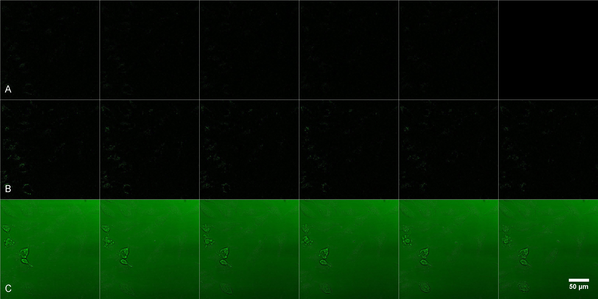
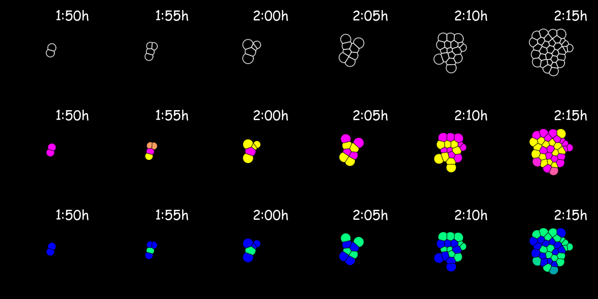

# Image Annotation

## Introduction

We have different types of images, resulting from some crazy biological experiment thingy, which were stitched together in a tabular fashion, see example.

Unfortunately, the images are missing their annotation which should give the reader the necessary information of how long these experiments were performed. In the end, it should look somewhat like this

## Challenge

Find a way to annotate these images in such a way that the user won't have to do it by hand. Use whatever you want to solve this, i.e. programming related or specific software/websites. However, keep in mind that this should also be applicable for images of different sizes and arrangements. Try your solution for the two pictures included in this directory `NACH MONENSINMontage of Untitled-1.png` and `beta-tox.tif`.

## Meeting

Our meeting will by on the 20. of November 2023 at 14:00 o'clock in Zoom (link will be posted in our Mattermost channel).