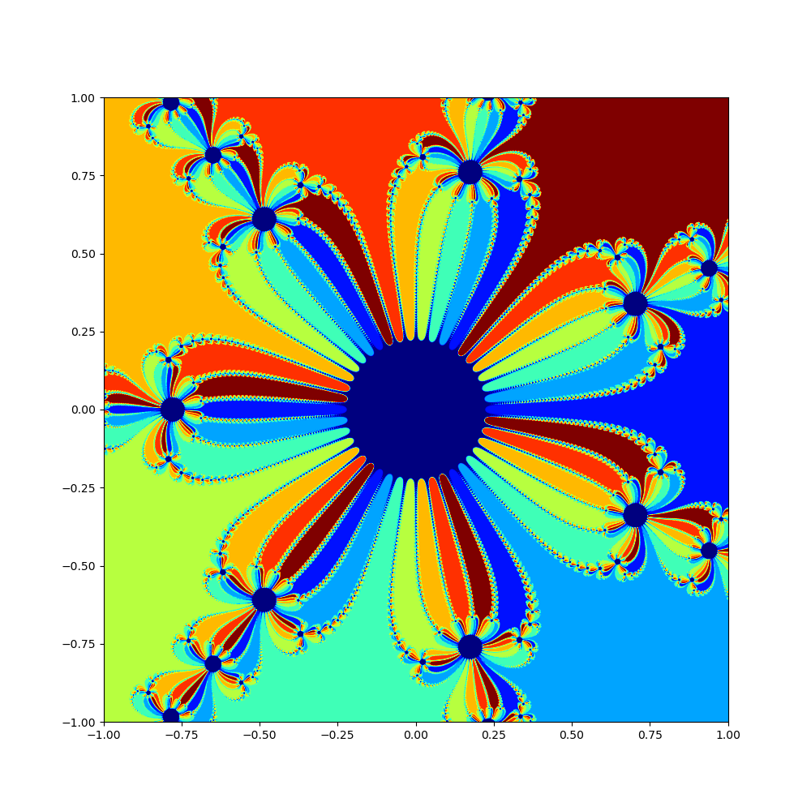

# Newton Fractals

## Introduction

In our last meeting, we already learned about Newton's method to solve equations or find the roots of a specific functions. This time, let's stray a little from the path of differential equations and take a slightly psychedelic look at fractals. We already saw that a function like
$$f(z) = z^5 - 1$$
has exactly five roots in the complex plane, i.e. values which fulfill $f(z)=0$. Complex numbers are a combination of real numbers $x, y \in \mathbb{R}$ together with the imaginary unit $i$ which is defined by $i^2 = -1$. They look like this
$$z = x + iy$$
where $x$ is called the real part and $y$ the imaginary part of $z$. For simplification, think of them like 2D numbers with $x$ and $y$ value, which is also how you will want to treat them for visualization. In Python, the imaginary unit $i$ is defined by `1j`, whereas in Julia it is defined by `1im`. The complex number $5 - 3i$ can then be programmed by `5 - 3*1j` or `5 - 3*1im` respectively.

Now for the fractal part, we have already seen last time that we need different initial values for our Newton iteration to converge to all five different roots of $f$. However, I chose very specific points for which I previously tested that they would converge to the desired values. If one applies Newton's method to a complex valued function $f$ for all of the initial values in a given range of $x$ and $y$ and colorize the specific point in the plane depending on which solution we get, the result will be a fractal. In short:

- Pick a value $z_0$ in the complex plane
- Use Newton's method to find the root
- Check to which root $z_0$ converged and assign it a color depending on the root it converged to, all roots should be colored differently
- Repeat the previous steps for more initial values $z_0$ in the complex plane and visualize your coloration

If done correctly, the result might look similar to this, depending on the exact function you used.

## Challenges

### Roots of unity

Try to visualize a Newton fractal for a function
$$f(z) = z^n - 1 \qquad \text{with} \qquad n > 2$$
its derivative is
$$f'(z) = nz^{n-1}$$
and the roots of the function, also called "roots of unity" are the $n$ values given by
$$z_k = \exp\left(\frac{2i \pi k}{n}\right) \qquad k = 0,1,\dots,n-1.$$
Choose appropriate intervals for $x$ and $y$, e.g. $[0,1]$, and try to get the best resolution possible without destroying your computer.

### Bonus

If you'd like, you can try to apply it to other functions as well, take any function you can think of and try to visualize its corresponding Newton fractal. The difficulty for this might be, that the roots of the function might not be known beforehand. Think about how you might solve this. This might also spark your imagination: [Wikipedia](https://en.wikipedia.org/wiki/Newton_fractal#Generalization_of_Newton_fractals).